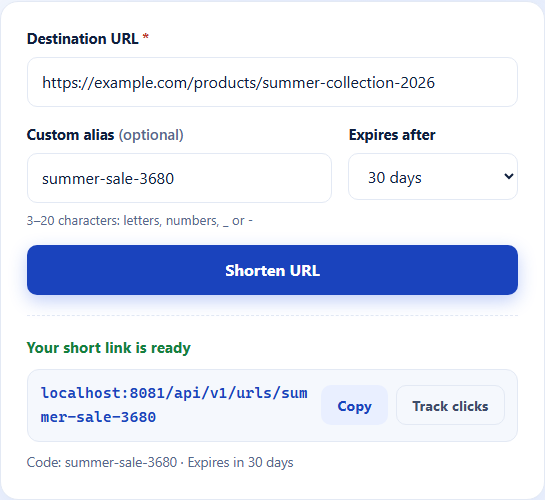
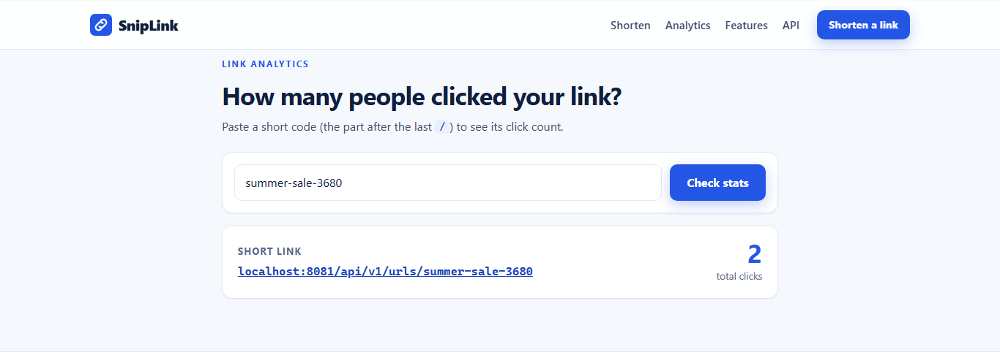
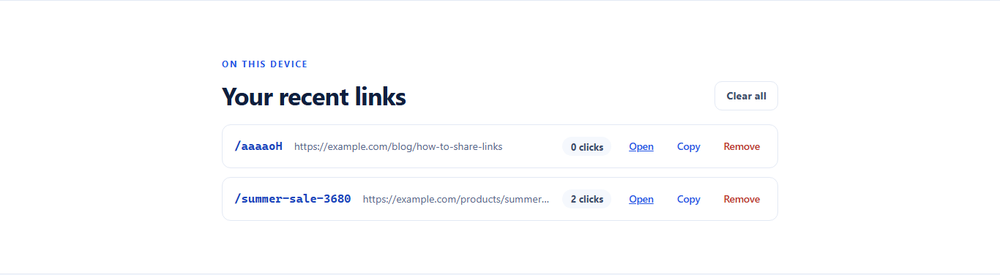
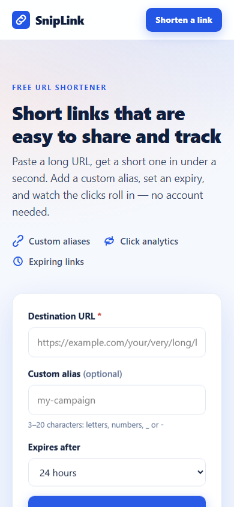

# URL Shortener — Scalable Distributed Backend + Web UI


A production-grade URL shortener backend engineered around distributed system principles:
atomic ID generation, deterministic sharding, cache-aside reads, and Redis-backed rate
limiting — plus **SnipLink**, a dependency-free web UI served by the same backend.
Designed to simulate how systems like Bitly operate under high traffic.

---

## Screenshots

| Landing page | Shorten with custom alias |
|---|---|
|  |  |

| Click analytics (2 real clicks) | Per-device link history | Mobile |
|---|---|---|
|  |  |  |

---

## Table of Contents

- [Overview](#overview)
- [Web UI (SnipLink)](#web-ui-sniplink)
- [Architecture](#architecture)
- [System Design Decisions](#system-design-decisions)
- [Request Flows](#request-flows)
- [Error Handling](#error-handling)
- [API Reference](#api-reference)
- [Running Locally](#running-locally)
- [Tech Stack](#tech-stack)

---

## Overview

The system provides URL shortening with optional custom aliases, ultra-fast redirection
via Redis cache, real-time click tracking, expiration with automatic DB cleanup, and
Redis-backed rate limiting per IP.

The focus is on **how** the system is built — not just what it does.

---

## Web UI (SnipLink)

A clean, TinyURL-style web UI is served directly by the backend — no build step, no
dependencies, same origin (so no CORS issues in the default setup).

- **Shorten form** — long URL + optional custom alias + expiry (1h / 24h / 7d / 30d)
- **Result card** — copy-to-clipboard, open, and one-click click tracking
- **Analytics lookup** — paste a code *or a full short URL* to see live click counts
- **Recent links** — per-device history in `localStorage` with copy / open / remove
- **Error UX** — friendly messages mapped from API status codes (`400` / `404` / `409` / `429`)
- **Accessible & responsive** — semantic HTML, skip link, labeled inputs, `aria-live`
  feedback, visible focus states, `prefers-reduced-motion` support, mobile-first layout

Source lives in `frontend/` (`index.html`, `styles.css`, `app.js`) and is published to
`src/main/resources/static/` (copy the files over and rebuild after editing).

---

## Architecture

```
Client (SnipLink UI or any HTTP client)
   ↓
Spring Boot (Stateless) — serves API + static UI
   ↓
Redis  ──────────────────────────────────────
  ├── Cache (read acceleration)              │
  ├── ID Generator (atomic INCR)             │
  ├── Click counters                         │
  └── Rate Limiter (Lua script)              │
                                             │
Shard Router (hash % N)                      │
   ↓                                         │
MySQL Shards ────────────────────────────────
  └── Source of truth
```

```
src/main/java/com/mahmoudyoussef/url_shortener/
│
├── controller/         # UrlController — shorten, redirect, stats
├── service/
│   ├── impl/           # UrlServiceImpl — core business logic
│   ├── CacheService    # Interface (Redis implementation injected)
│   ├── RateLimiterService  # Interface
│   ├── RedisRateLimiterService  # Lua-script atomic rate limiting
│   ├── RedisCacheService   # Fail-safe Redis cache
│   ├── ShardRouter     # Deterministic shard routing
│   └── UrlCleanupService   # Scheduled expired URL cleanup
├── repository/
│   ├── ShardedUrlRepository  # Raw JDBC — explicit shard routing + schema init
│   └── ClickTrackingRepository  # Redis click counters (fail-open)
├── generator/
│   ├── RedisIdGenerator  # Atomic ID via Redis INCR + fallback
│   └── Base62Generator   # ID → short code encoding
├── entity/             # UrlMapping — shortCode, longUrl, expiresAt
├── dto/                # ShortenRequest, ShortenResponse, ErrorResponse
├── config/             # ShardDataSourceConfig, ClientIpResolver, RedisConfig, CorsConfig
└── exception/          # GlobalExceptionHandler + typed exceptions
```

---

## System Design Decisions

### No ORM — Raw JDBC

JPA is deliberately excluded. `ShardedUrlRepository` uses `JdbcTemplate` directly with
explicit shard routing. This gives full control over query execution, eliminates N+1
risks, and keeps the persistence layer transparent.

### Schema Init Per Shard

Hibernate `ddl-auto` only manages the default datasource, so the repository creates the
`url_mapping` table itself (`CREATE TABLE IF NOT EXISTS`) on **every** shard at startup.
Fresh Docker volumes and new shards work with zero migrations.

### Distributed ID Generation

```
Redis INCR → globally unique integer → Base62 encode → short code
```

`RedisIdGenerator` allocates IDs from Redis in batches of 100. A random-base fallback
activates automatically if Redis is unavailable — the system keeps operating in degraded
mode without throwing.

### Cache-Aside Pattern

Redis is a performance layer only. MySQL is always the source of truth. On a cache miss,
the full entity is loaded from the DB and the Redis TTL is computed from the URL's actual
`expires_at` — not a fixed offset — ensuring the cache never outlives the record.

### Redirect Flow

1. Request hits `/api/v1/urls/{code}`
2. Check Redis cache

**Cache HIT**
→ return URL
→ increment click count
→ HTTP 302 redirect

**Cache MISS**
→ load full entity from DB (including `expiresAt`)
→ compute remaining TTL based on expiration
→ cache URL with exact TTL
→ increment click count
→ HTTP 302 redirect

```

### Expiration — DB as Source of Truth

Expiration is persisted in `url_mapping.expires_at`. All DB queries filter expired records at the SQL level:

```sql
WHERE short_code = ? AND (expires_at IS NULL OR expires_at > NOW())
```

This means an expired URL is never returned even on a Redis cache miss. Redis TTL is a hint, not the authority.

### Scheduled Cleanup Job

`UrlCleanupService` runs every hour via `@Scheduled(fixedRate = 3600000)`:

```sql
DELETE FROM url_mapping WHERE expires_at IS NOT NULL AND expires_at <= NOW()
```

Prevents table bloat and maintains query performance over time.

### Deterministic Sharding

The system uses hash-based sharding to route each short code to a specific MySQL shard:

shard = floorMod(hash(shortCode), N)

Deployed with 2 MySQL shards (`mysql-shard-0`, `mysql-shard-1`). Scaling to N shards requires only adding datasource entries in configuration — no code changes needed. Shard count is derived dynamically from the number of configured datasources.

This ensures:
- Deterministic routing (same code → same shard)
- No cross-shard joins or coordination
- Horizontal scalability by configuration only

No routing table required. Any node can route any request independently. `JdbcTemplate` instances per shard are initialized lazily and cached in a `ConcurrentHashMap` — one connection pool per shard, created on first use.

### Rate Limiting — Atomic Lua Script

The naive approach (`INCR` then `EXPIRE` as separate commands) has a race condition: if the process crashes between the two calls, the key never expires. This is solved with a single Lua script executed atomically:

```lua
local current = redis.call('INCR', KEYS[1])
if current == 1 then
  redis.call('EXPIRE', KEYS[1], ARGV[1])
end
return current
```

Separate rate limit keys per operation type: `rate:shorten:{ip}`, `rate:redirect:{ip}`, `rate:stats:{ip}` (10 requests/minute each). Fail-open: if Redis is unavailable, requests pass through rather than blocking the system.

### Client IP Resolution

`ClientIpResolver` checks `X-Forwarded-For` and `X-Real-IP` headers before falling back to `getRemoteAddr()`. Ensures correct IP identification behind load balancers and reverse proxies.

---
### Expired URL Cleanup

Expired URLs are removed using a scheduled cleanup job that iterates across all configured shards.

Each shard is initialized at application startup to ensure cleanup covers all shards without relying on lazy initialization.

This guarantees:
- No orphaned expired records
- Consistent cleanup across all shards
- Operational correctness in multi-shard environments

---
## Request Flows

### Shorten URL

```
POST /api/v1/urls
 → Rate limit check (Redis Lua, per IP)
 → Custom alias? → check DB for collision
 → Auto-generate? → Redis INCR → Base62 encode → retry on collision
 → Insert into DB (correct shard via floorMod(hash, N))
 → Write to Redis cache with TTL
 → Return shortUrl + code
```

### Redirect

```
GET /api/v1/urls/{code}
 → Rate limit check
 → Redis cache lookup
   → HIT  → increment click counter → 302 redirect
   → MISS → DB query (expired filter) → cache write → increment → 302 redirect
 → 404 if not found or expired
```

### Stats

```
GET /api/v1/urls/{code}/stats
 → Rate limit check
 → DB lookup (expired filter)
 → Redis click counter read
 → Return shortUrl + code + clickCount
```

---

## Error Handling

All errors return a consistent JSON envelope via `GlobalExceptionHandler` (`@RestControllerAdvice`):

```json
{
  "status": 409,
  "message": "Alias already exists: google",
  "path": "/api/v1/urls",
  "timestamp": "2025-01-15T10:30:00Z"
}
```

| Exception | HTTP | Trigger |
|---|---|---|
| `DuplicateAliasException` | 409 | Custom alias already taken |
| `UrlNotFoundException` | 404 | Code not found or expired |
| `TooManyRequestsException` | 429 | Rate limit exceeded |
| `MethodArgumentNotValidException` / `ConstraintViolationException` | 400 | Validation failure |
| `HttpMessageNotReadableException` | 400 | Malformed JSON body |
| `NoResourceFoundException` | 404 | Unknown route |
| `Exception` (fallback) | 500 | Unexpected server error |

---

## API Reference

Full interactive docs: `http://localhost:8080/swagger-ui/index.html`

| Method | Endpoint | Description |
|---|---|---|
| `POST` | `/api/v1/urls` | Shorten a URL |
| `GET` | `/api/v1/urls/{code}` | Redirect to original URL (`302`) |
| `GET` | `/api/v1/urls/{code}/stats` | Get click count and metadata |

### Shorten Request

```json
{
  "url": "https://example.com/very/long/path",
  "expirationSeconds": 3600,
  "customAlias": "my-link"
}
```

| Field | Required | Validation |
|---|---|---|
| `url` | ✅ | Must match `https?` or `ftp` scheme |
| `expirationSeconds` | ❌ | Minimum 60 seconds (default: 24h) |
| `customAlias` | ❌ | 3–20 chars, alphanumeric + `_` `-` |

### Shorten Response

```json
{
  "shortUrl": "http://localhost:8080/api/v1/urls/aB3xYz",
  "code": "aB3xYz",
  "clickCount": 0
}
```

> Never hardcode the `shortUrl` prefix on the client — it is built from the server-side
> `app.base-url` property and always returned by the API.

---

## Running Locally

### With Docker (recommended)

```bash
git clone https://github.com/MahmoudYoussef-web/url-shortener-system.git
cd url-shortener-system

cp .env.example .env
# Edit .env and set DB_PASSWORD

docker-compose up --build
```

API: `http://localhost:8080`
Web UI: `http://localhost:8080/`
Swagger: `http://localhost:8080/swagger-ui/index.html`

### Without Docker

**Prerequisites:** Java 21, Maven, MySQL 8, Redis 7

```bash
cp src/main/resources/application.example.properties \
   src/main/resources/application.properties
# Edit datasource and Redis config

./mvnw spring-boot:run
```

On Windows there is also `run-local.bat` (starts the packaged jar with local shard
ports and Redis on `localhost`).

### Configuration

| Variable | Description | Default |
|---|---|---|
| `SERVER_PORT` | HTTP port | `8080` |
| `APP_BASE_URL` | Prefix used to build `shortUrl` | `http://localhost:8080/api/v1/urls/` |
| `DB_USERNAME` / `DB_PASSWORD` | Shard credentials (docker profile) | — |
| `SPRING_DATASOURCE_URL` | Default datasource (local runs) | shard-0 |
| `APP_SHARDS_DATASOURCE_0_URL` / `APP_SHARDS_DATASOURCE_1_URL` | Shard JDBC URLs (local runs) | `localhost:3307` / `localhost:3308` |
| `REDIS_HOST` / `REDIS_PORT` | Redis (docker profile) | `redis` / `6379` |
| `app.cors.allowed-origins` | Browser origins allowed on `/api/**` | `http://localhost:3000` |

### Environment Variables

| Variable | Description |
|---|---|
| `DB_URL` | MySQL JDBC URL |
| `DB_USERNAME` | Database username |
| `DB_PASSWORD` | Database password |
| `REDIS_HOST` | Redis hostname |
| `REDIS_PORT` | Redis port (default `6379`) |

---

## Tech Stack

| Category | Technology |
|---|---|
| Language | Java 21 |
| Framework | Spring Boot 3 |
| Persistence | Raw JDBC (`JdbcTemplate`) — no ORM |
| Cache / ID Gen / Rate Limiting | Redis 7 |
| Database | MySQL 8 (2 shards) |
| Frontend | Vanilla HTML + CSS + JS (no dependencies) |
| Containerization | Docker + Docker Compose |
| Docs | SpringDoc OpenAPI (Swagger UI) |
| Build | Maven |

---

## Author

**Mahmoud Youssef** — Backend Engineer
[GitHub](https://github.com/MahmoudYoussef-web)
